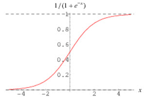
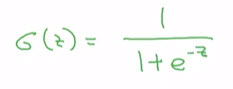
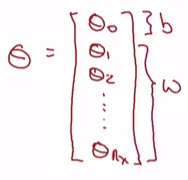

```{r setup, include=FALSE}
library(tufte)
# invalidate cache when the tufte version changes
knitr::opts_chunk$set(tidy = FALSE, cache.extra = packageVersion('tufte'))
options(htmltools.dir.version = FALSE)
```

[Week 1]() [Week 2](week_02.html)

## Introduction
In this video, we'll go over `logistic regression`. This is a learning algorithm that you use when the output labels $y$ in a supervised learning problem are all either zero or one, for binary classification problems. 

## Theory
Given an input feature vector $x$, maybe corresponding to an image that you want to recognize as either a cat picture or not a cat picture, you want an algorithm that can output a prediction, which we'll call $\hat{y}$, which is your estimate of $y$.  

```{marginfigure}
More formally, you want $\hat{y}$ to be the probability of the chance that, $y$ is equal to one **given** the input features $x$.
$$ \hat{y} =  P(y=1 | x)$$
```

```{r fig.margin = TRUE, fig.cap = "Logistic Regression parameters", fig.width=3.5, fig.height=3.5, cache=TRUE, echo=FALSE}

```

So in other words, if $x$ is a picture, as we saw in the last video, you want $\hat{y}$ hat to tell you, what is the chance that this is a cat picture? So $x$, as we said in the previous video, is an $n_x$ dimensional vector $\mathbb{R}^{n_x}$, given that the **parameters** of the `logistic regression` will be $w$ which is also an $n_x$ dimensional vector $\mathbb{R}^{n_x}$, together with $b$, which is just a real number $\mathbb{R}$. 

```{marginfigure}
So $\hat{y}$ should really be between zero and one, and it's difficult to enforce that because  $w^T x + b$ can be much bigger than one, or it can even be negative, which doesn't make sense for probability, that you want it to be between zero and one. 
$$0 \leq \hat{y} \leq 1$$
```

So given an input $x$ and the parameters $w$ and $b$, how do we generate the output $\hat{y}$? Well, one thing you could try, that doesn't work, would be to have $\hat{y}$ be $w^T x + b$, kind of a linear function of the input $x$. And in fact, this is what you use if you were doing linear regression. But this isn't a very good algorithm for `binary classification` because you want $\hat{y}$ to be the chance that $y$ is equal to one. 


```{marginfigure}
So in logistic regression our output is instead going to be $\hat{y}$ equals the sigmoid function applied to this quantity. This is what the sigmoid function looks like:
```

```{r fig.margin = TRUE, fig.cap = "Sigmoid function", fig.width=3.5, fig.height=3.5, cache=TRUE, echo=FALSE}

```

If on the horizontal axis I plot $z$, then the function sigmoid of $z$ looks like this. So it goes smoothly from zero up to one. Let me label my axes here, this is zero and it crosses the vertical axis as 0.5. So this is what sigmoid of $z$ looks like. And we're going to use $z$ to denote this quantity, $w^T x + b$. 

```{marginfigure}
Here's the formula for the sigmoid function: Sigmoid of $z$, where $z$ is a real number $\mathbb{R}$, is one over one plus $e$ to the negative $z$.
```

```{r fig.margin = TRUE, fig.width=3.5, fig.height=3.5, cache=TRUE, echo=FALSE}

```


So notice a couple of things: ff $z$ is very large then $e^{-z}$ will be close to zero ($e^{-z} \approx 0$). So then $\sigma(z)$  will be approximately $\frac{1}{1 + \approx0}$, because $e$ to the negative of very large number will be close to zero. So this is close to 1. And indeed, if you look in the plot on the left, if $z$ is very large the $\sigma(z)$ is very close to one.

$$\sigma(z) \approx 1, \text{if } z \to \infty$$

Conversely, if $z$ is very small, or it is a very large negative number, then $\sigma(z)$ becomes $\frac{1}{1 + e{- -\infty}}$, and this becomes, it's a huge number. So this becomes, think of it as one over one plus a number that is very, very big, and so, that's close to zero. And indeed, you see that as $z$ becomes a very large negative number, $\sigma(z)$ goes very close to zero.

$$\sigma(z) \approx 0, \text{if } z \to -\infty$$  

So when you implement logistic regression, your job is to try to learn parameters $w$ and $b$ so that $\hat{y}$ becomes a good estimate of the chance of $y$ being equal to one. 

## Notation

Before moving on, just another note on the notation. When we program neural networks, we'll usually keep the parameter $w$ and parameter $b$ separate, where here, $b$ corresponds to an intercept. 

```{marginfigure}
In this alternative notational convention, you have vector parameters theta:
$$\theta = \begin{bmatrix}  \theta_{0} \\  \theta_{1} \\  \theta_{2} \\ ... \\ \theta_{n_x}  \end{bmatrix}$$

And so, $\theta_0$ takes the role of $b$, that's just a real number, and $\theta_1$ down to $\theta_{n_x}$ play the role of $w$.
```

```{r fig.margin = TRUE, fig.width=3.5, fig.height=3.5, cache=TRUE, echo=FALSE}

```

In some other courses, you might have seen a notation that handles this differently. In some conventions you define an extra feature called $x_0$ and that equals to one. So that now $x$ is $\mathbb{R}^{n_x + 1}$. And then you define $\hat{y} = \sigma(\theta^T x)$. 


It turns out, when you implement your neural network, it will be easier to just keep $b$ and $w$ as separate parameters. And so, in this class, we will not use any of this notational convention that I just wrote in red. 

If you've not seen this notation before in other courses, don't worry about it. It's just that for those of you that have seen this notation I wanted to mention explicitly that we're not using that notation in this course. But if you've not seen this before, it's not important and you don't need to worry about it. 

So you have now seen what the logistic regression model looks like. Next to change the parameters $w$ and $b$ you need to define a cost function.
