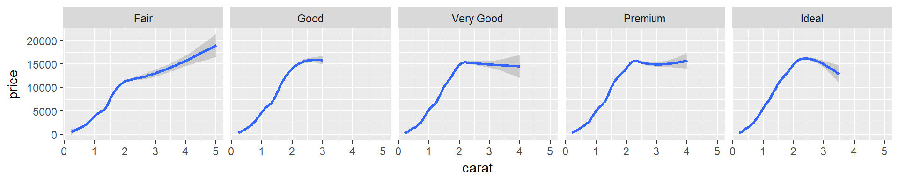
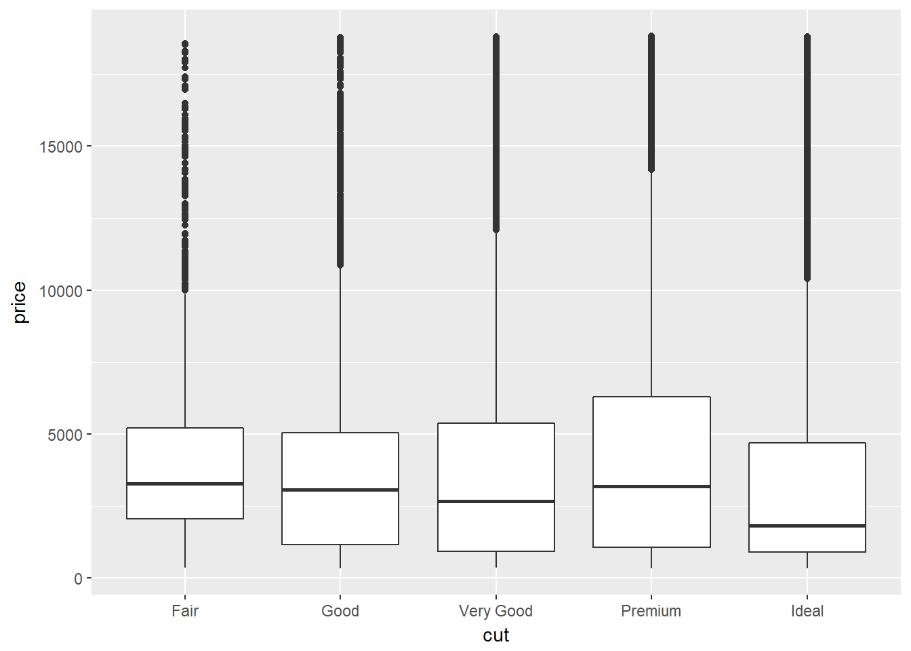
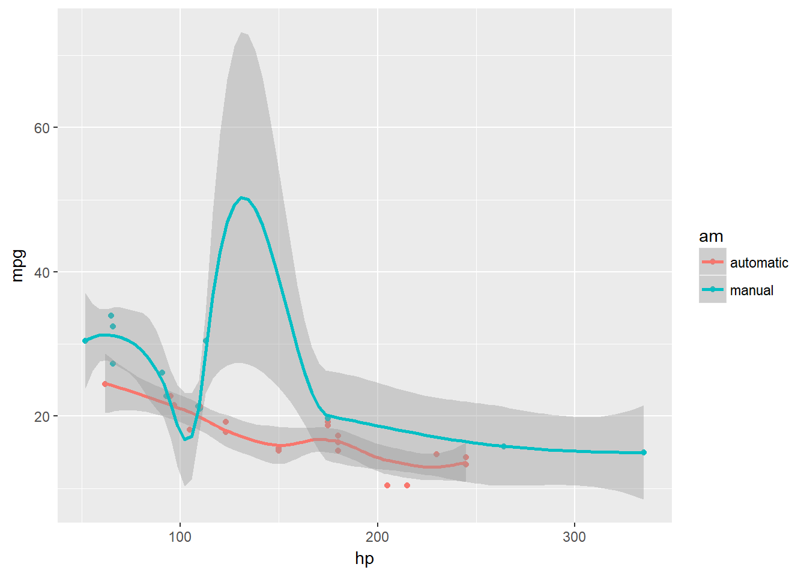
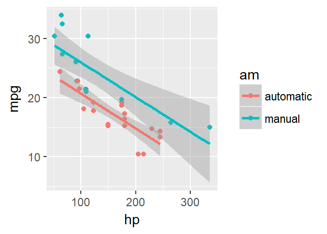
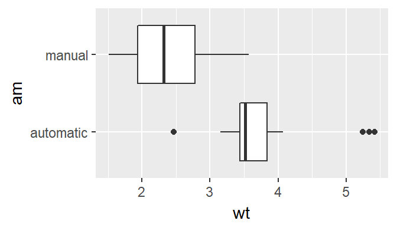
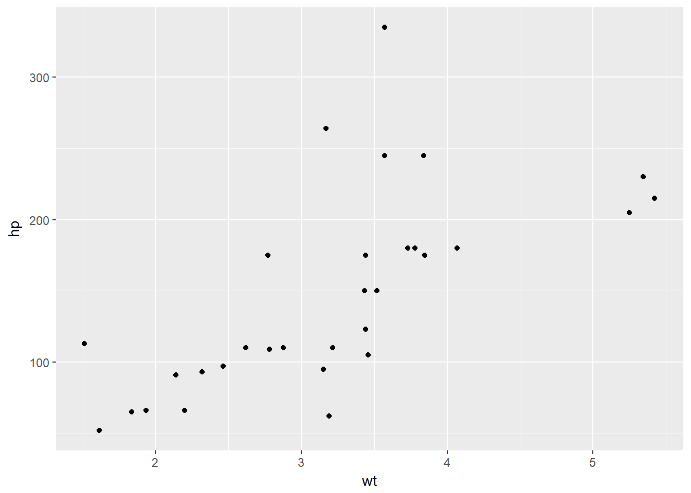
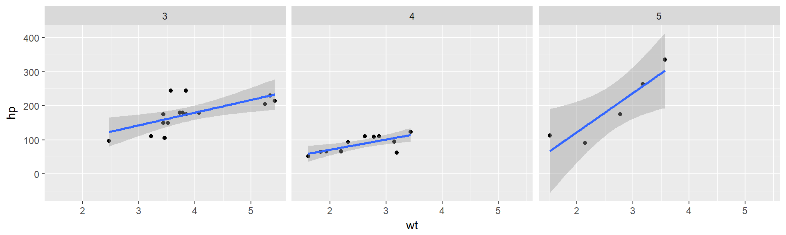

# Introduction

The Tufte handout style is a style that Edward Tufte uses in his books and handouts. Tufte's style is known for its extensive use of sidenotes, tight integration of graphics with text, and well-set typography. This style has been implemented in LaTeX and HTML/CSS^[See Github repositories [tufte-latex](https://github.com/tufte-latex/tufte-latex) and [tufte-css](https://github.com/edwardtufte/tufte-css)], respectively. We have ported both implementations into the [**tufte** package](https://github.com/rstudio/tufte). If you want LaTeX/PDF output, you may use the `tufte_handout` format for handouts, and `tufte_book` for books. For HTML output, use `tufte_html`. These formats can be either specified in the YAML metadata at the beginning of an R Markdown document (see an example below), or passed to the `rmarkdown::render()` function. See @R-rmarkdown more information about **rmarkdown**.

This file was downloaded from [rmarkdown.rstudio,com/gallery.html](https://raw.githubusercontent.com/rstudio/tufte/master/inst/rmarkdown/templates/tufte_html/skeleton/skeleton.Rmd).

```yaml
---
title: "An Example Using the Tufte Style"
author: "John Smith"
output:
  tufte::tufte_handout: default
  tufte::tufte_html: default
---
```

There are two goals of this package:

1. To produce both PDF and HTML output with similar styles from the same R Markdown document;
1. To provide simple syntax to write elements of the Tufte style such as side notes and margin figures, e.g. when you want a margin figure, all you need to do is the chunk option `fig.margin = TRUE`, and we will take care of the details for you, so you never need to think about `\begin{marginfigure} \end{marginfigure}` or `<span class="marginfigure"> </span>`; the LaTeX and HTML code under the hood may be complicated, but you never need to learn or write such code.

If you have any feature requests or find bugs in **tufte**, please do not hesitate to file them to https://github.com/rstudio/tufte/issues. For general questions, you may ask them on StackOverflow: http://stackoverflow.com/tags/rmarkdown.

# Headings

This style provides first and second-level headings (that is, `#` and `##`), demonstrated in the next section. You may get unexpected output if you try to use `###` and smaller headings.

<span class="newthought">In his later books</span>^[[Beautiful Evidence](http://www.edwardtufte.com/tufte/books_be)], Tufte starts each section with a bit of vertical space, a non-indented paragraph, and sets the first few words of the sentence in small caps. To accomplish this using this style, call the `newthought()` function in **tufte** in an _inline R expression_ `` `r ` `` as demonstrated at the beginning of this paragraph.^[Note you should not assume **tufte** has been attached to your R session. You should either `library(tufte)` in your R Markdown document before you call `newthought()`, or use `tufte::newthought()`.]

# Figures

## Margin Figures

Images and graphics play an integral role in Tufte's work. To place figures in the margin you can use the **knitr** chunk option `fig.margin = TRUE`. For example:

<p> <aside><p class="caption">MPG vs horsepower, colored by transmission.</p></aside></p>

```r
library(ggplot2)
mtcars2 <- mtcars
mtcars2$am <- factor(
  mtcars$am, labels = c('automatic', 'manual')
)
ggplot(mtcars2, aes(hp, mpg, color = am)) +
  geom_point() + geom_smooth() +
  theme(legend.position = 'bottom')
```

Note the use of the `fig.cap` chunk option to provide a figure caption. You can adjust the proportions of figures using the `fig.width` and `fig.height` chunk options. These are specified in inches, and will be automatically scaled down to fit within the handout margin.

## Arbitrary Margin Content

In fact, you can include anything in the margin using the **knitr** engine named `marginfigure`. Unlike R code chunks ```` ```{r} ````, you write a chunk starting with ```` ```{marginfigure} ```` instead, then put the content in the chunk. See an example on the right about the first fundamental theorem of calculus.

<div class="marginfigure">
<p>We know from <em>the first fundamental theorem of calculus</em> that for <span class="math inline"><em>x</em></span> in <span class="math inline">[<em>a</em>, <em>b</em>]</span>: <br /><span class="math display">$$\frac{d}{dx}\left( \int_{a}^{x} f(u)\,du\right)=f(x).$$</span><br /></p>
</div>

For the sake of portability between LaTeX and HTML, you should keep the margin content as simple as possible (syntax-wise) in the `marginefigure` blocks. You may use simple Markdown syntax like `**bold**` and `_italic_` text, but please refrain from using footnotes, citations, or block-level elements (e.g. blockquotes and lists) there.

Note: if you set `echo = FALSE` in your global chunk options, you will have to add `echo = TRUE` to the chunk to display a margin figure, for example ```` ```{marginfigure, echo = TRUE} ````.

## Full Width Figures

You can arrange for figures to span across the entire page by using the chunk option `fig.fullwidth = TRUE`.


```r
ggplot(diamonds, aes(carat, price)) + geom_smooth() +
  facet_grid(~ cut)
```

<p> <aside><p class="caption">A full width figure.</p></aside></p>

 Other chunk options related to figures can still be used, such as `fig.width`, `fig.cap`, `out.width`, and so on. For full width figures, usually `fig.width` is large and `fig.height` is small. In the above example, the plot size is $10 \times 2$.

## Main Column Figures

Besides margin and full width figures, you can of course also include figures constrained to the main column. This is the default type of figures in the LaTeX/HTML output.


```r
ggplot(diamonds, aes(cut, price)) + geom_boxplot()
```

<p> <aside><p class="caption">A figure in the main column.</p></aside></p>

# Sidenotes

One of the most prominent and distinctive features of this style is the extensive use of sidenotes. There is a wide margin to provide ample room for sidenotes and small figures. Any use of a footnote will automatically be converted to a sidenote. ^[This is a sidenote that was entered using a footnote.] 

If you'd like to place ancillary information in the margin without the sidenote mark (the superscript number), you can use the `margin_note()` function from **tufte** in an inline R expression. <label for="tufte-mn-" class="margin-toggle">&#8853;</label><input type="checkbox" id="tufte-mn-" class="margin-toggle"><span class="marginnote">This is a margin note.  Notice that there is no number preceding the note.</span> This function does not process the text with Pandoc, so Markdown syntax will not work here. If you need to write anything in Markdown syntax, please use the `marginfigure` block described previously.

# References

References can be displayed as margin notes for HTML output. For example, we can cite R here [@R-base]. To enable this feature, you must set `link-citations: yes` in the YAML metadata, and the version of `pandoc-citeproc` should be at least 0.7.2. You can always install your own version of Pandoc from http://pandoc.org/installing.html if the version is not sufficient. To check the version of `pandoc-citeproc` in your system, you may run this in R:


```r
system2('pandoc-citeproc', '--version')
```

If your version of `pandoc-citeproc` is too low, or you did not set `link-citations: yes` in YAML, references in the HTML output will be placed at the end of the output document.

# Tables

You can use the `kable()` function from the **knitr** package to format tables that integrate well with the rest of the Tufte handout style. The table captions are placed in the margin like figures in the HTML output.


```r
knitr::kable(
  mtcars[1:6, 1:6], caption = 'A subset of mtcars.'
)
```


Table: A subset of mtcars.

                      mpg   cyl   disp    hp   drat      wt
------------------  -----  ----  -----  ----  -----  ------
Mazda RX4            21.0     6    160   110   3.90   2.620
Mazda RX4 Wag        21.0     6    160   110   3.90   2.875
Datsun 710           22.8     4    108    93   3.85   2.320
Hornet 4 Drive       21.4     6    258   110   3.08   3.215
Hornet Sportabout    18.7     8    360   175   3.15   3.440
Valiant              18.1     6    225   105   2.76   3.460

# Block Quotes

We know from the Markdown syntax that paragraphs that start with `>` are converted to block quotes. If you want to add a right-aligned footer for the quote, you may use the function `quote_footer()` from **tufte** in an inline R expression. Here is an example:

> "If it weren't for my lawyer, I'd still be in prison. It went a lot faster with two people digging."
>
> <footer>--- Joe Martin</footer>

Without using `quote_footer()`, it looks like this (the second line is just a normal paragraph):

> "Great people talk about ideas, average people talk about things, and small people talk about wine."
>
> --- Fran Lebowitz

# Responsiveness

The HTML page is responsive in the sense that when the page width is smaller than 760px, sidenotes and margin notes will be hidden by default. For sidenotes, you can click their numbers (the superscripts) to toggle their visibility. For margin notes, you may click the circled plus signs to toggle visibility.

# More Examples

The rest of this document consists of a few test cases to make sure everything still works well in slightly more complicated scenarios. First we generate two plots in one figure environment with the chunk option `fig.show = 'hold'`:


```r
p <- ggplot(mtcars2, aes(hp, mpg, color = am)) +
  geom_point()
p
p + geom_smooth()
```

<p> <aside><p class="caption">Two plots in one figure environment.</p></aside></p><p> <aside><p class="caption">Two plots in one figure environment.</p></aside></p>

Then two plots in separate figure environments (the code is identical to the previous code chunk, but the chunk option is the default `fig.show = 'asis'` now):


```r
p <- ggplot(mtcars2, aes(hp, mpg, color = am)) +
  geom_point()
p
```

<p> <aside><p class="caption">Two plots in separate figure environments (the first plot).</p></aside></p>

```r
p + geom_smooth()
```

<p> <aside><p class="caption">Two plots in separate figure environments (the second plot).</p></aside></p>

You may have noticed that the two figures have different captions, and that is because we used a character vector of length 2 for the chunk option `fig.cap` (something like `fig.cap = c('first plot', 'second plot')`).

Next we show multiple plots in margin figures. Similarly, two plots in the same figure environment in the margin:

<p> <aside><p class="caption">Two plots in one figure environment in the margin.</p></aside></p><p> <aside><p class="caption">Two plots in one figure environment in the margin.</p></aside></p>

```r
p
p + geom_smooth(method = 'lm')
```

Then two plots from the same code chunk placed in different figure environments:


```r
knitr::kable(head(iris, 15))
```


 Sepal.Length   Sepal.Width   Petal.Length   Petal.Width  Species 
-------------  ------------  -------------  ------------  --------
          5.1           3.5            1.4           0.2  setosa  
          4.9           3.0            1.4           0.2  setosa  
          4.7           3.2            1.3           0.2  setosa  
          4.6           3.1            1.5           0.2  setosa  
          5.0           3.6            1.4           0.2  setosa  
          5.4           3.9            1.7           0.4  setosa  
          4.6           3.4            1.4           0.3  setosa  
          5.0           3.4            1.5           0.2  setosa  
          4.4           2.9            1.4           0.2  setosa  
          4.9           3.1            1.5           0.1  setosa  
          5.4           3.7            1.5           0.2  setosa  
          4.8           3.4            1.6           0.2  setosa  
          4.8           3.0            1.4           0.1  setosa  
          4.3           3.0            1.1           0.1  setosa  
          5.8           4.0            1.2           0.2  setosa  

<p> <aside><p class="caption">Two plots in separate figure environments in the margin (the first plot).</p></aside></p>

```r
p
```

```r
knitr::kable(head(iris, 12))
```


 Sepal.Length   Sepal.Width   Petal.Length   Petal.Width  Species 
-------------  ------------  -------------  ------------  --------
          5.1           3.5            1.4           0.2  setosa  
          4.9           3.0            1.4           0.2  setosa  
          4.7           3.2            1.3           0.2  setosa  
          4.6           3.1            1.5           0.2  setosa  
          5.0           3.6            1.4           0.2  setosa  
          5.4           3.9            1.7           0.4  setosa  
          4.6           3.4            1.4           0.3  setosa  
          5.0           3.4            1.5           0.2  setosa  
          4.4           2.9            1.4           0.2  setosa  
          4.9           3.1            1.5           0.1  setosa  
          5.4           3.7            1.5           0.2  setosa  
          4.8           3.4            1.6           0.2  setosa  

<p> <aside><p class="caption">Two plots in separate figure environments in the margin (the second plot).</p></aside></p>

```r
p + geom_smooth(method = 'lm')
```

```r
knitr::kable(head(iris, 5))
```


 Sepal.Length   Sepal.Width   Petal.Length   Petal.Width  Species 
-------------  ------------  -------------  ------------  --------
          5.1           3.5            1.4           0.2  setosa  
          4.9           3.0            1.4           0.2  setosa  
          4.7           3.2            1.3           0.2  setosa  
          4.6           3.1            1.5           0.2  setosa  
          5.0           3.6            1.4           0.2  setosa  

We blended some tables in the above code chunk only as _placeholders_ to make sure there is enough vertical space among the margin figures, otherwise they will be stacked tightly together. For a practical document, you should not insert too many margin figures consecutively and make the margin crowded. 

You do not have to assign captions to figures. We show three figures with no captions below in the margin, in the main column, and in full width, respectively.

<p> <aside></aside></p>

```r
# a boxplot of weight vs transmission; this figure
# will be placed in the margin
ggplot(mtcars2, aes(am, wt)) + geom_boxplot() +
  coord_flip()
```

```r
# a figure in the main column
p <- ggplot(mtcars, aes(wt, hp)) + geom_point()
p
```

<p> <aside></aside></p>

```r
# a fullwidth figure
p + geom_smooth(method = 'lm') + facet_grid(~ gear)
```

<p> <aside></aside></p>

# Some Notes on Tufte CSS

There are a few other things in Tufte CSS that we have not mentioned so far. If you prefer <span class="sans">sans-serif fonts</span>, use the function `sans_serif()` in **tufte**. For epigraphs, you may use a pair of underscores to make the paragraph italic in a block quote, e.g.

> _I can win an argument on any topic, against any opponent. People know this, and steer clear of me at parties. Often, as a sign of their great respect, they don't even invite me._
>
> <footer>--- Dave Barry</footer>

We hope you will enjoy the simplicity of R Markdown and this R package, and we sincerely thank the authors of the Tufte-CSS and Tufte-LaTeX projects for developing the beautiful CSS and LaTeX classes. Our **tufte** package would not have been possible without their heavy lifting.

You can turn on/off some features of the Tufte style in HTML output. The default features enabled are:

```yaml
output:
  tufte::tufte_html:
    tufte_features: ["fonts", "background", "italics"]
```

If you do not want the page background to be lightyellow, you can remove `background` from `tufte_features`. You can also customize the style of the HTML page via a CSS file. For example, if you do not want the subtitle to be italic, you can define

```css
h3.subtitle em {
  font-style: normal;
}
```

in, say, a CSS file `my_style.css` (under the same directory of your Rmd document), and apply it to your HTML output via the `css` option, e.g.,

```yaml
output:
  tufte::tufte_html:
    tufte_features: ["fonts", "background"]
    css: "my_style.css"
```

There is also a variant of the Tufte style in HTML/CSS named "[Envisoned CSS](http://nogginfuel.com/envisioned-css/)". This style can be used by specifying the argument `tufte_variant = 'envisioned'` in `tufte_html()`^[The actual Envisioned CSS was not used in the **tufte** package. We only changed the fonts, background color, and text color based on the default Tufte style.], e.g.

```yaml
output:
  tufte::tufte_html:
    tufte_variant: "envisioned"
```

To see the R Markdown source of this example document, you may follow [this link to Github](https://github.com/rstudio/tufte/raw/master/inst/rmarkdown/templates/tufte_html/skeleton/skeleton.Rmd), use the wizard in RStudio IDE (`File -> New File -> R Markdown -> From Template`), or open the Rmd file in the package:


```r
file.edit(
  tufte:::template_resources(
    'tufte_html', '..', 'skeleton', 'skeleton.Rmd'
  )
)
```

This document is also available in [Chinese](http://rstudio.github.io/tufte/cn/), and its `envisioned` style can be found [here](http://rstudio.github.io/tufte/envisioned/).


