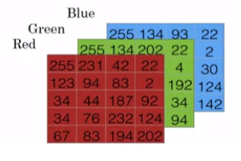

```{r setup, include=FALSE}
library(tufte)
# invalidate cache when the tufte version changes
knitr::opts_chunk$set(tidy = FALSE, cache.extra = packageVersion('tufte'))
options(htmltools.dir.version = FALSE)
```

[Week 1]() [Week 2](week_02.html)

# Introduction
Hello, and welcome back. In this week we're going to go over the basics of **neural network programming**.

It turns out that when you implement a neural network there are some techniques that are going to be really important. 

For example, if you have a training set of $m$ training examples, you might be used to processing the training set by having a `for-loop` step through your $m$ training examples. But it turns out that when you're implementing a neural network, you usually want to process your entire training set without using an explicit for-loop to loop over your entire training set. So, you'll see how to do that in this week's materials. 

Another idea, when you organize the computation of, in your network, usually you have what's called a `forward pause` or `forward propagation step`, followed by a `backward pause` or what's called a backward propagation step. And so in this week's materials, you also get an introduction about why the computations, in learning and neural network can be organized in this forward propagation and a separate backward propagation.

For this week's materials I want to convey these ideas using **logistic regression** in order to make the ideas easier to understand. But even if you've seen logistic regression before, I think that there'll be some new and interesting ideas for you to pick up in this week's materials. 

So with that, let's get started. 


# Theory

```{r fig.margin = TRUE, fig.cap = "Here is an example of binary classification problem", fig.width=2.5, fig.height=2.5, cache=TRUE, echo=FALSE}

```

Logistic regression is an algorithm for binary classification. So let's start by setting up the problem. Here's an example of a binary classification problem. You might have an input of an image, like that, and want to output a label to recognize this image as either being a cat, in which case you output $1$, or not-cat in which case you output $0$, and we're going to use y to denote the output label. 


Let's look at how an image is represented in a computer. 

```{r fig.margin = TRUE, fig.width=3.5, fig.height=3.5, cache=TRUE, echo=FALSE}

```

To store an image your computer stores three separate matrices corresponding to the red, green, and blue color channels of this image. So if your input image is 64 pixels by 64 pixels, then you would have 3 64 by 64 matrices corresponding to the red, green and blue pixel intensity values for your images.^[Although to make this little slide I drew these as much smaller matrices, so these are actually 5 by 4 matrices rather than 64 by 64.] 


So to turn these pixel intensity values- into a feature vector, what we're going to do is unroll all of these pixel values into an input feature vector x. So to unroll all these pixel intensity values into Feature vector, what we're going to do is define a feature vector x corresponding to this image as follows. We're just going to take all the pixel values 255, 231, and so on. 255, 231, and so on until we've listed all the red pixels. And then eventually 255 134 255, 134 and so on until we get a long feature vector listing out all the red, green and blue pixel intensity values of this image. If this image is a 64 by 64 image, the total dimension of this vector x will be 64 by 64 by 3 because that's the total numbers we have in all of these matrixes. Which in this case, turns out to be 12,288, that's what you get if you multiply all those numbers. And so we're going to use nx=12288 to represent the dimension of the input features x. And sometimes for brevity, I will also just use lowercase n to represent the dimension of this input feature vector. So in binary classification, our goal is to learn a classifier that can input an image represented by this feature vector x, and predict whether the corresponding label y is 1 or 0, that is, whether this is a cat image or a non-cat image. 


# Notation

Let's now lay out some of the notation that we'll use throughout the rest of this course. A single training example is represented by a pair, (x,y) where x is an x-dimensional feature vector and y, the label, is either 0 or 1. Your training sets will comprise lower-case m training examples. And so your training sets will be written (x(1), y(1)) which is the input and output for your first training example; (x(2), y(2)) for the second training example up to (x(m), y(m)) which is your last training example. And then that altogether is your entire training set. 

So I'm going to use lowercase m to denote the number of training samples. And sometimes to emphasize that this is the number of train examples, I might write this as M = Mtrain. And when we talk about a test set, we might sometimes use m subscript test to denote the number of test examples. So that's the number of test examples. 

Finally, to output all of the training examples into a more compact notation, we're going to define a matrix, capital X. As defined by taking you training set inputs x1, x2 and so on and stacking them in columns. So we take x(1) and put that as a first column of this matrix, x(2), put that as a second column and so on down to Xm, then this is the matrix capital X. So this matrix X will have m columns, where M is the number of train examples and the number of rows, or the height of this matrix is nx. Notice that in other courses, you might see the matrix capital X defined by stacking up the train examples in rows like so, x(1) transpose down to x(m) transpose. It turns out that when you're implementing neural networks using this convention I have on the left, will make the implementation much easier. So just to recap, x is a nx by m dimensional matrix, and when you implement this in Python, you see that X.shape, that's the Python command for finding the shape of the matrix, that this an (nx, m). That just means it is an nx by m dimensional matrix. 

So that's how you group the training examples, input x into matrix. How about the output labels Y? It turns out that to make your implementation of a neural network easier, it would be convenient to also stack Y In columns. So we're going to define capital Y to be equal to y(1), y(2), up to y(m) like so. So Y here will be a 1 by m dimensional matrix. And again, to use the Python notation, the shape of Y will be (1, m). Which just means this is a 1 by m matrix. 

And as you implement your neural network, later in this course, you find that a useful convention would be to take the data associated with different training examples, and by data I mean either x or y, or other quantities you see later. But to take the stack or the data associated with different training examples and to stack them in different columns, like we've done here for both x and y. 
So, that's a notation we we'll use e for a regression and for neural networks networks later in this course. If you ever forget what a piece of notation means, like what is M or what is N or what is something else, we've also posted on the course website a notation guide that you can use to quickly look up what any particular piece of notation means. So with that, let's go on to the next video where we'll start to fetch out logistic regression using this notation.


