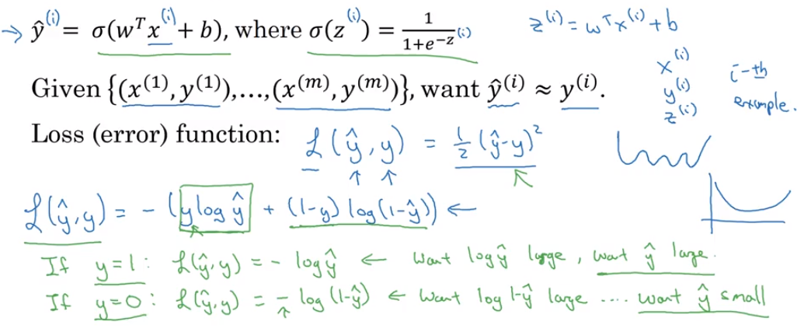

```{r setup, include=FALSE}
library(tufte)
# invalidate cache when the tufte version changes
knitr::opts_chunk$set(tidy = FALSE, cache.extra = packageVersion('tufte'))
options(htmltools.dir.version = FALSE)
```

[Week 1](week_01.html) [Week 2](week_02.html)

In a previous video, you saw the logistic regression model. To train the parameters $w$ and $b$ of the logistic regression model, you need to define a cost function. Let's take a look at the cost function you can use to train logistic regression. 

To recap, this is what we had to find from the previous slide. So your output, $\hat y$, is *sigmoid of w transpose x plus b*^[$\hat y = \sigma(w x^T + b)$], where a *sigmoid of z*,^[$\sigma(z)$: *sigmoid of z*], is as defined here^[$\sigma(z) = \dfrac {1}{1+e^{-z}}$]. So to learn parameters for your model you're given a training set of $m$ training examples, and it seems natural that you want to find parameters $w$ and $b$, so that at least on the training set, the outputs you have, the predictions you have, on the training set, which we only write as $\hat y^{(i)}$, that that will be close to the ground truth labels $y_i$ that you got in the training set. 

# Superscript notation
So, to throw in a little bit more detail for the equation on top, we had said that $\hat y$, is as defined at the top, for a training example $x$, and, of course, for each training example, we're using these superscripts with round brackets with parentheses to index and to differentiate examples. Your prediction on training sample $^{(i)}$, which is $\hat y^{(i)}$, is going to be obtained by taking the sigmoid function, and applying it to $w^T x^{(i)}$ (the input of the training example), plus $b$, and you can also define $z^{(i)}$ as follows^[$z^{(i)} = w^T x^{(i)} + b$]. 

So throughout this course, we're going to use this notational convention, that the superscript parentheses $^{(i)}$ refers to data, $x$ or $y$ or $z$, or something else, associated with the $i^{th}$ training example, associated with the $i^{th}$ example. That's what the superscript $^{(i)}$ in parentheses means. 


# The Loss (error) function
Now, let's see what loss function or error function we can use to measure how well our algorithm is doing. 

One thing you could do is define the loss when your algorithm outputs $\hat y$ and the true label as $y$ to be, maybe the square error, or one half a square error.^[$\mathcal{L} (\hat y, y)= \frac {1}{2} (\hat y - y)^2$] It turns out that you could do this, but in logistic regression people don't usually do this because when you come to learn the parameters, you find that the optimization problem which we talk about later becomes [non-convex](). So, you end up with an optimization problem with multiple local optima. So, gradient descent may not find the global optimum.

If you didn't understand the last couple of comments. Don't worry about it, we'll get to it in later video. But the intuition to take away is that this function $\mathcal{L}$, called the loss function, is a function you'll need to define to measure how good our output $\hat y$ is, when the true label is $y$. 

As square error seems like it might be a reasonable choice, except that it makes gradient descent not work well. So, in logistic regression, we will actually define a different loss function that plays a similar role as squared error. That will give us an optimization problem that is [convex](), and so we'll see in that later video becomes much easier to optimize. 

So, what we use in logistic regression is actually the following loss function which I'm just like right up here^[$\mathcal{L(\hat y, y)} = -(y \log \hat y) + (1-y) \log(1 - \hat y)$]. 

Here's some intuition for why this loss function makes sense. 

Keep in mind that if we're using squared error, then you want the squared error to be **as small as possible**. And with this logistic regression loss function, we'll also want this to be **as small as possible**. 

To understand why this makes sense, let's look at the two cases; when $y$ = 1, and then, when $y$ = 0. 


In the first case, let's say, $y$ = 1. Then, the loss function is just writing the first term of the equation, because if $y$ = 1, then the second term $(1 - y)$ is equal to 0^[$\mathcal{L(\hat y, y)} = -(y \log \hat y)$]. So, this says, if $y$ = 1, you want $-\log \hat y$ to be **as big as possible**. So that means you want $\log \hat y$ to be large, to be **as big as possible**, and that means you want $\hat y$ to be large. But because $\hat y$, is the sigmoid function^[$\sigma(z) = \dfrac {1}{1+e^{-z}}$], it can never be bigger than 1. So, this is saying that, if $y$ = 1, you want $\hat y$ to be as big as possible. But it can't ever be bigger than 1, so, saying you want $\hat y$ to be close to 1 as well. 

The other case is if $y$ = 0. If y equals zero, then this first term in the loss function is equal to zero because $y$ is zero, and then the second term defines the loss function. So the loss becomes $-\log (1 - \hat y)$^[$\mathcal{L(\hat y, y)} = -\log (1 - \hat y)$]. And so, if in your learning procedure you try to make the loss function small, what this means is that you want $-\log (1 - \hat y)$ to be large. And, because it's a negative sign there, and then through a similar piece of reasoning, you can conclude that this loss function is trying to make $\hat y$ as small as possible. And again, because $\hat y$ has to be between 0 and 1, this is saying that if $y$ = 0, then your loss function $\mathcal{L}$, will push the parameters to make $\hat y$ as close to 0 as possible. Now, there are a lot of functions with roughly this effect, that if $y$ = 1, we try to make $\hat y$ large, and if $y$ = 0, we try to make $\hat y$ small. 

```{r fig.fullwidth = TRUE, fig.cap = "Summary slide", out.width="85%", cache=TRUE, echo=FALSE}

```

We just gave here in green a somewhat informal justification for this loss function $\mathcal{L}$. We will provide an optional video later to give a more formal justification for why in logistic regression we like to use the loss function with this particular form. 

# The Cost function
Finally, the loss function was defined with respect to a single training example. It measures how well you're doing on a single training example. 

I'm now going to define something called the cost function, which measures how well you're doing an entire training set. 

So the cost function J which is applied to your parameters $w$ and $b$ is going to be the average with one over m of the sum of the loss function, applied to each of the training examples and turn^[$$J(w, b) = \dfrac{1}{m} \sum_{i=1}^m \mathcal{L(\hat y^{(i)}, y^{(i)})}$$], while here $\hat y$, is, of course, the prediction output by your logistic regression algorithm, using you know, a particular set of parameters $w$ and $b$. 


And, so, just to expand this out, this is equal to this^[$$-\dfrac{1}{m} \sum_{i=1}^m [y^{(i)} \log \hat y^{(i)} + (1 - y^{(i)}) \log (1 - \hat y^{(i)})]$$]. I guess I could put square brackets here. So the minus sign is outside everything else. 

So, the terminology I'm going to use is that the loss function is applied to just a single training example, like so^[$\mathcal{L(\hat y^{(i)}, y^{(i)})}$]. And the cost function is the cost of your parameters^[$J(w, b)$]. 

So, in training your logistic regression model, we're going to try to find parameters $w$ and $b$ that minimize the overall costs of function $J$, written at the bottom.

# Closing words

So, you've just seen the set up for the logistic regression algorithm, the loss function for training example $\mathcal{L}$, and the overall cost function for the parameters of your algorithm, $J$. It turns out that logistic regression can be viewed as a very, very small neural network. 

In the next video we'll go over that so you can start gaining intuition about what neural networks do. So, that. Let's go onto the next video about how to view logistic regression as a **very small neural network**.
