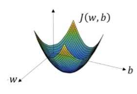
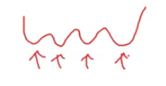
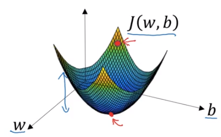
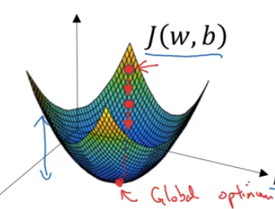
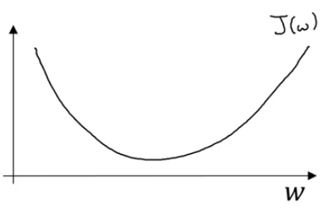
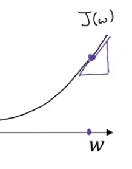
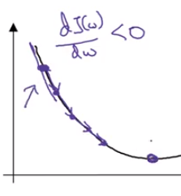
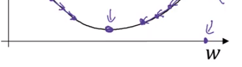

```{r setup, include=FALSE}
library(knitr)

## adjust plot margins
## first one from https://yihui.name/knitr/hooks/
knit_hooks$set(small.mar = function(before, options, envir) {
    if (before) par(mar = c(4.2, 4.2, .1, .1))  # smaller margin on top and right
})
knit_hooks$set(tiny.mar = function(before, options, envir) {
    if (before) par(mar = c(.1, .1, .1, .1))  # tiny margin all around
})
knit_hooks$set(smallish.mar = function(before, options, envir) {
    if (before) par(mar = c(4.2, 4.2, 0.9, 0.9))  # smallish margins on top and right
})
```

You've seen the logistic regression model. You've seen the loss function that measures how well you're doing on the single training example. You've also seen the cost function that measures how well your parameters w and b are doing on your entire training set. Now let's talk about how you can use the gradient descent algorithm to train, or to learn, the parameters $w$ and $b$ on your training set. 

To recap, here is the familiar logistic regression algorithm^[$$\hat y = \sigma(w x^T + b) \\ \sigma(z) = \dfrac {1}{1+e^{-z}}$$]. And we have on the second line the cost function, $J$, which is a function of your parameters $w$ and $b$.^[$$J(w,b) = - \frac {1}{m} \sum_{i=1}^m \mathcal{L}(\hat{y}^{(i))}, y^{(i)})$$] 

And that's defined as the average; so, it's 1 over m, times the sum of this loss function. And, so, the loss function measures how well your algorithms outputs $\hat y^{(i)}$, on each of the training examples, stacks up or compares to the ground true label $y^{(i)}$, on each of the training examples. And the full formula is expanded out on the right.^[$$-\dfrac{1}{m} \sum_{i=1}^m [y^{(i)} \log \hat y^{(i)} + (1 - y^{(i)}) \log (1 - \hat y^{(i)})]$$] 

So, the cost function measures how well your parameters $w$ and $b$ are doing on the training set. So, in order to learn the set of parameters $w$ and $b$, it seems natural that we want to find $w$ and $b$ that make the cost function $J(w, b)$ as small as possible. 

```{r fig.margin = TRUE, fig.cap = "gradient descent", out.width="80%", cache=TRUE, echo=FALSE}

```

So here's an illustration of gradient descent. In this diagram the horizontal axes represent your spatial parameters, $w$ and $b$. In practice, $w$ can be much higher dimensional, but for the purposes of plotting, let's illustrate $w$ as a single real number and $b$ as a single real number. The cost function $J(w,b)$ is, then, some surface above these horizontal axes $w$ and $b$. So, the height of the surface represents the value of $J(w,b)$ at a certain point. And what we want to do is really to find the value of $w$ and $b$ that corresponds to the minimum of the cost function $J$. 

```{r fig.margin = TRUE, fig.cap = " ", out.width="90%", cache=TRUE, echo=FALSE, smallish.mar=TRUE}

```
It turns out that this cost function $J$ is a convex function. So it's just a single big bowl, so this is a convex function and this is opposed to functions that look like this^[non-convex function], which are non-convex and has lots of different local optima. So, the fact that our cost function $J(w,b)$, as defined here, is convex is one of the huge reasons why we use this particular cost function, $J$, for logistic regression. 

```{r fig.margin = TRUE, fig.cap = " ", out.width="90%", cache=TRUE, echo=FALSE, smallish.mar=TRUE}

```
So, to find a good value for the parameters, what we'll do is initialize $w$ and $b$ to some initial value, maybe denoted by that little red dot. And for logistic regression almost any initialization method works, usually you initialize the value to zero. 


Random initialization also works, but people don't usually do that for logistic regression. But because this function is convex, no matter where you initialize, you should get to the same point or roughly the same point. 
And what gradient descent does is, it starts at that initial point and then takes a step in the steepest downhill direction. So after one step of gradient descent you might end up there, because it's trying to take a step downhill in the direction of steepest descent or as quickly downhill as possible. 

```{r fig.margin = TRUE, fig.cap = " ", out.width="90%", cache=TRUE, echo=FALSE, smallish.mar=TRUE}

```
So, that's one iteration of gradient descent. And after two iterations of gradient descent you might step there, three iterations and so on. I guess this is now hidden by the back of the plot until eventually, hopefully you converge to this global optimum or get to something close to the global optimum. 
So this picture illustrates the gradient descent algorithm. 


```{r fig.margin = TRUE, fig.cap = " ", out.width="90%", cache=TRUE, echo=FALSE, smallish.mar=TRUE}

```
Let's write a bit more of the details. For the purpose of illustration, let's say that there's some function, $J(w)$, that you want to minimize, and maybe that function looks like this^[looks like this]. To make this easier to draw, I'm going to ignore $b$ for now, just to make this a one-dimensional plot instead of a high-dimensional plot. 

So, gradient descent does this. We're going to repeatedly carry out the following update. We're going to take the value of w and update it, going to use colon equals to represent updating $w$. So, set $w$ to $w$ minus $\alpha$, times, and this derivative^[$w := w - \alpha \dfrac {dJ(w)} {dw}$].

I will repeatedly do that until the algorithm converges. 
So couple of points in the notation:

> $\alpha$ here, is the *learning rate*, and controls how big a step we take on each iteration or gradient descent^[$\alpha$: learning rate]. We'll talk later about some ways by choosing the learning rate $\alpha$. 

> And second, this quantity here^[$\dfrac {dJ(w)} {dw}$], this is a *derivative*. This is basically the update or the change you want to make to the parameters $w$. 

When we start to write code to implement gradient descent, we're going to use the convention that the variable name in our code $dw$ will be used to represent this derivative term. So when you write code you write something like $w := w - \alpha dw$. And so we use $dw$ to be the variable name to represent this derivative term.^[$w := w - \alpha dw$]

Now let's just make sure that this gradient descent update makes sense. 

Let's say that $w$ was over here.

```{r fig.margin = TRUE, fig.cap = "positive slope", out.width="50%", cache=TRUE, echo=FALSE, smallish.mar=TRUE}

```
So you're at this point on the cost function $J(w)$. Remember that the definition of a derivative is the slope of a function at the point. So, the slope of the function is really the height divided by the width, right? Of a low triangle here at this tangent to $J(w)$, at that point. And so, here the derivative is positive. $w$ gets updated as $w$ minus a learning rate times the derivative^[$w := w - \alpha dJ$]. The derivative is positive and so you end up subtracting from $w$, so you end up taking a step to the left. And so gradient descent will make your algorithm slowly decrease the parameter if you have started off with this large value of $w$. 


```{r fig.margin = TRUE, fig.cap = "negative slope", out.width="50%", cache=TRUE, echo=FALSE, smallish.mar=TRUE}

```

As another example, if $w$ was over here, then at this point, the slope here of $dJ(w)/dw$ will be negative, and so the gradient descent update would subtract alpha times a negative number^[$w:= w - \alpha (-\dfrac{dJ}{dw})$]. And so end up slowly increasing $w$, so you end up making $w$ bigger and bigger with successive iterations and gradient descent. 

```{r fig.margin = TRUE, fig.cap = "global minimum", out.width="65%", cache=TRUE, echo=FALSE, smallish.mar=TRUE}

```
So, that, hopefully, whether you initialize on the left or on the right, gradient descent will move you towards this global minimum here. 

If you're not familiar with derivatives, or with calculus, and what this term $dJ(w)/dw$ means^[$\dfrac {dJ(w)}{dw}$], don't worry too much about it. We'll talk some more about derivatives in the next video. 

If you have a deep knowledge of calculus, you might be able to have a deeper intuitions about how neural networks work. But even if you're not that familiar with calculus, in the next few videos we'll give you enough intuitions about derivatives and about calculus that you'll be able to effectively use neural networks. 

But the overall intuition for now is that this term^[$\dfrac {dJ(w)}{dw}$] represents the slope of the function, and we want to know the slope of the function at the current setting of the parameters so that we can take these steps of steepest descent, so that we know what direction to step in in order to go downhill on the cost function $J$. 

So we wrote our gradient descent for $J(s)$ if only $w$ was your parameter. In logistic regression, your cost function is a function of both $w$ and $b$^[$J(w, b)$]. So in that case, the inner loop of gradient descent, that is this thing here, this thing you have to repeat becomes as follows. You end up updating $w$ as $w$ minus the learning rate times the derivative of $J(w, b)$, respect to $w$.^[$w := w - \alpha \dfrac {dJ(w, b)}{dw}$] And you update $b$ as $b$ minus the learning rate $\alpha$ times the derivative of the cost function in respect to $b$^[$b := b - \alpha \dfrac {dJ(w,b)}{db}$]. 

So these two equations at the bottom are the actual update you implement. 

As an aside I just want to mention one notational convention in calculus that is a bit confusing to some people. I don't think it's super important that you understand calculus, but in case you see this I want to make sure that you don't think too much of this. Which is that in calculus, this term here^[$\dfrac {dJ(w,b)}{dw}$], we actually write as follows, of that funny squiggle symbol^[$\dfrac {\partial J(w,b)}{\partial w}$]. So this symbol, this is actually just a lower case d in a fancy font, in a stylized font for when you see this expression all this means is this isn't [INAUDIBLE] $J(w,b)$ or really the slope of the function $J(w,b)$, how much that function slopes in the w direction. 

And the rule of the notation in calculus, which I think isn't totally logical, but the rule in the notation for calculus, which I think just makes things much more complicated than you need to be is that if $J$ is a function of two or more variables, then instead of using lowercase $d$ you use this funny symbol $\partial$. This is called a partial derivative symbol. 

But don't worry about this, and if $J$ is a function of only one variable, then you use lowercase $d$. So the only difference between whether you use this funny partial derivative symbol $\partial$, or lowercase $d$, as we did on top, is whether $J$ is a function of two or more variables. In which case, you use this symbol, the partial derivative symbol, $\partial$, or if $J$ is only a function of one variable then you use lowercase $d$. 

This is one of those funny rules of notation in calculus that I think just make things more complicated than they need to be. But if you see this partial derivative symbol all it means is you're measure the slope of the function, with respect to one of the variables. 

And similarly to adhere to the formerly correct mathematical notation in calculus, because here $J$ has two inputs not just one, this thing at the bottom should be written with this partial derivative simple $\partial$. But it really means the same thing as, almost the same thing as lowercase $d$^[$\dfrac {\partial J(w,b)}{\partial b}$]. 

Finally, when you implement this in code, we're going to use the convention that this quantity, really the amount by which you update $w$, will denote as the variable $dw$ in your code^[$\dfrac {\partial J(w,b)}{\partial w} \rightarrow dw$]. And this quantity, right? The amount by which you want to update b will denote by the variable $db$ in your code^[$\dfrac {\partial J(w,b)}{\partial b} \rightarrow db$]. 

All right, so, that's how you can implement gradient descent. 

Now if you haven't seen calculus for a few years, I know that that might seem like a lot more derivatives in calculus than you might be comfortable with so far. But if you're feeling that way, don't worry about it. 

In the next video, we'll give you better intuition about derivatives. And even without the deep mathematical understanding of calculus, with just an intuitive understanding of calculus, you will be able to make neural networks work effectively. 

So that, let's go onto the next video where we'll talk a little bit more about derivatives.
