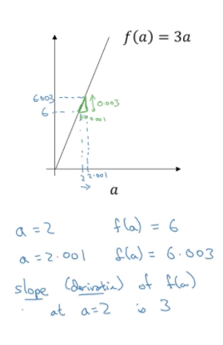
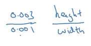
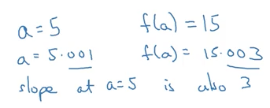
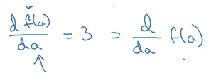

In this video I want to help you gain an intuitive understanding of calculus and the derivatives. 

Now, maybe you're thinking that you haven't seen calculus since your college days, and depending on when you graduate maybe that was quite some time back now. If that's what you're thinking don't worry, you don't need a deep understanding of calculus in order to apply neural networks and deep learning very effectively.

So, if you're watching this video, or some of the later videos, be wondering how this stuff really for me this calculus looks really complicated, my advice to you is the following, which is that, watch the videos, and then if you could do the homework and complete the programming homework successfully, then you can apply deep learning.

In fact, what you see later is that in week 4, will define a couple of types of functions that will enable you to encapsulate everything that needs to be done with respect to calculus. That these functions called [forward functions] and [backward functions], that you learn about, the less you put everything you need to know about counselors into these functions, so that you don't need to worry about them anymore. Beyond that but I thought that in this foray into deep learning that this week we should open up the box and peer a little bit further into the details of calculus but really all you need is an intuitive understanding of this in order to build and successfully apply these algorithms.

And, finally, if you are among that maybe smaller group of people that are expert in calculus, if you're very familiar with calculus, observe this. It's probably okay for you to skip this video but for everyone else let's dive in and try to get an intuitive understanding of derivatives.

```{r fig.margin = TRUE, fig.cap = "gradient descent", out.width="90%", cache=TRUE, echo=FALSE}

```
I've plotted here the function $f(a) = \mathrm{3}$, so it's just a straight line to gain intuition about derivatives. Let's look at a few points on this function. 

Let's say that $a$ is equal to $\mathrm{2}$. In that case, $f(a)$,  which is equal to $\mathrm 3$ times $a$, is equal to 6 so if $a=\mathrm{2}$, then you know $f(a)$ will be equal to \mathrm{6}. Let's say we give the value of $a$ just a little bit of a nudge; I'm going to just bump up me a little bit so there is now $\mathrm{2.001}$, right? So, I'm going to get a like a tiny little nudge to the right so now is let's say $\mathrm{2.001}$ this plug this is to scale 2.01, the $\mathrm{0.001}$ difference is too small to show on this plot this give them a little nudge to the right now, $f(a)$ is equal to three times at so $\mathrm{6.003}$ Simplot this over here this is not the scale, this is $\mathrm{6.003}$.

So, if you look at this low triangle here, some highlighting in green, what we see is that if I match a $\mathrm{0.001}$ to the right then $f(a)$ goes up by $\mathrm{0.03}$, the amount that $f(a)$ went up is three times as big as the amount that I judged $a$ to the right, so we're going to say that the slope of the derivative of the function $f(a)$ at $a = \mathrm 2$, when $a$ is equal to $\mathrm 2$, the slope this reading and you know the term derivative basically means **slope**. It's just that derivative sounds like a scary, a more intimidating word, whereas slope is a friendlier way to describe the concept of derivative. So, one of these year derivative just think slope of the function.


```{r fig.margin = TRUE, fig.cap = "gradient descent", out.width="80%", cache=TRUE, echo=FALSE}

```
And more formally, the slope is defined as the height divided by the width of this little triangle that we have in green so this is you know 0.03 over 0.01 and the fact that the slope is equal to 3 or the derivative is equal 3 just represents the fact that when you watch a to the right by 0.01, by tiny amount the amount, that $f(a)$ goes up is three times as big as the amount that United the inertial a in the horizontal direction so that's all that the slope of a line is.


```{r fig.margin = TRUE, fig.cap = "gradient descent", out.width="90%", cache=TRUE, echo=FALSE}

```
Now, let's look at this function at a different point. Let's say that a is now equal to $\texttt 5$. In that case, $f(a) = 3a$ is equal to $\texttt 15$. 

So let's say I again give $a$ and notch to the right a tiny longnecks is now bumped up to $5.001$. $f(a)$ is three times that so $f(a)$ is equal to $\texttt 15.003$. And so, once again, when I bump into the right notch $a$ to the right by $\texttt 0.001$, $f(a)$ goes up three times as much, so the slope again at $a = \texttt 5$ is also $\texttt 3$.

so, the way we write is that the slope of the function $f$ is equal to 3. We say $df(a)/da$ and this just means the slope of the function $f(a)$ when you nudge the variable $a$ a tiny little amount, um this is equal to 3, and an alternative way to write this derivative formula is as follows.


```{r fig.margin = TRUE, fig.cap = "gradient descent", out.width="90%", cache=TRUE, echo=FALSE}

```
You can also write this as $\dfrac {d}{da} f(a)$. So, whether you put the $f(a)$ on top, or whether you write it down here, it doesn't matter. All this equation means is that if I nudge a to the right a little bit, I expect $f(a)$ to go up by 3 times as much as I not just the value of little a.

Now, for this video, I explained derivatives talking about what happens when we nudge the variable a by 0.001 um. If you want the formal mathematical definition of the derivatives, derivatives are defined with an even smaller value of how much energy a to the right so it's not open over 1 is not 0.001 is not 0.0 and so on 1 is sort of even smaller than that.

And the formal definition of derivative says what have you nudge $a$ to the right by an infinitesimal amount basically an infinite infinitely tiny tiny amount, if you do that does $f(a)$ go up three times as much as whatever was a tiny tiny tiny amount that you nudge stay to the right. So, that's actually the formal definition of a derivative but for the purposes of our intuitive understanding, we're going to talk about nudging $a$ to the right by this small amount 0.001, even if it's 0.001 isn't exactly you know tiny tiny infinitesimal.

Now, one property of the derivative is that no matter where you take the slope of this function, it is equal to 3, whether $a = \texttt{2}$, or $a=\texttt {5}$, the slope of this function is equal to $\texttt 3$, meaning that whatever is the value of $a$, if you increase it by $\texttt 0.001$, that value of $f(a)$ goes up by three times as much, so this function has the same slope everywhere, and one way to see that is that wherever you draw this your little triangle right the height divided by the width always has a ratio of three to one^[No matter where you take the slope of this function $f(a) = 3 \, a$, the slope is $3$. Same as saying, height divided by the width, gives a ratio of  $\texttt{3:1}$].

So, I hope this gives you a sense of what the slope what the derivative of the function means for a straight line where in this example the slope of the function was three everywhere, in the next video let's take a look at a slightly more complex example where the slopes of the function can be different at different points on the function.

