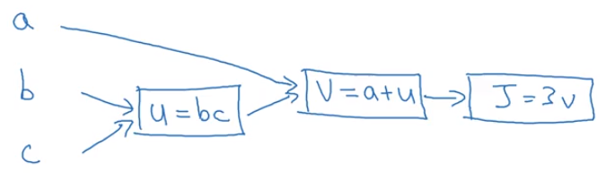
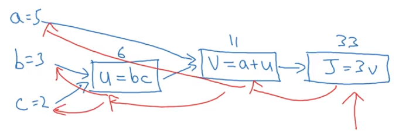

You've heard me say that the computations of a neural network are organized in terms of a forward pass or a forward propagation step, in which we compute the output of the neural network, followed by a backward pass or back propagation step, which we use to compute gradients or compute derivatives. 

The computation graph explains why it is organized this way. 

In this video, we'll go through an example. 

In order to illustrate the computation graph, let's use a simpler example than logistic regression, or a full blown neural network.

Let's say that we're trying to compute a function, $J$, which is a function of three variables a, b, and c^[$J(a,b,c)$]; and let's say that function is 3(a+bc).^[$J(a,b,c) = 3(a+bc)$]

Computing this function actually has three distinct steps. 

The first is you need to compute what is $bc$; and let's say we store that in the variable called $u$.^[$u = bc$] So $u=bc$, and then you may compute $v=a + u$. So let's say this is $v$.^[$v = a + u$] And then finally, your output $J$ is $3v$.^[$J = 3v$]  So this is your final function $J$ that you're trying to compute.

We can take these three steps and draw them in a computation graph as follows. 

Let's say, I draw your three variables $a$, $b$, and $c$ here. So the first thing we did was compute $u=bc$. So, I'm going to put a rectangular box around that. So. the input to that first box are $b$ and $c$. And then, you might have $v=a+u$, so, the inputs to that are $u$, which we just computed together with $a$. And then finally, we have $J=3v$. 

```{r fig.marginwdth = TRUE, fig.cap = "computation graph", out.width="80%", cache=TRUE, echo=FALSE}

```

So as a concrete example, if $a=\texttt 5$, $b=\texttt 3$ and $c=\texttt 2$, then $u=bc$ would be $\texttt 6$, because $a+u$, would be $\texttt 5 + \texttt 6$ is $\texttt {11}$, $J$ is three times that, so $J=\texttt {33}$. And indeed, hopefully, you can verify that this, is $\texttt 3 \times (\texttt 5 + \texttt 3 \times \texttt 2)$. And, if you expand that out, you actually get $\texttt {33}$ as the value of $J$. 

So, the computation graph comes in handy when there is some distinguished or some special output variable, such as $J$ in this case, that you want to optimize. And in the case of a logistic regression, $J$ is, of course, the cost function that we're trying to minimize. 

And what we're seeing in this little example is that, through a left-to-right pass, you can compute the value of $J$. And what we'll see in the next couple of slides is that in order to compute derivatives, there'll be a right-to-left pass indicated by the <span style="color:red">red arrows</span> like this, 

```{r fig.marginwdth = TRUE, fig.cap = "blue arrows is forward propagation; red arrows is backward propagation in the computation graph", out.width="90%", cache=TRUE, echo=FALSE}

```
kind of going in the opposite direction as the <span style="color:blue">blue arrows</span>. That would be most natural for computing the derivatives. So to recap, the computation graph organizes a computation with this blue arrows, left-to-right computation. 

Let's refer to the next video how you can do the backward red arrow, right-to-left, computation of the derivatives. Let's go on to the next video.