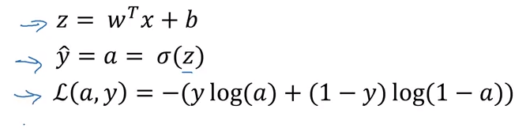
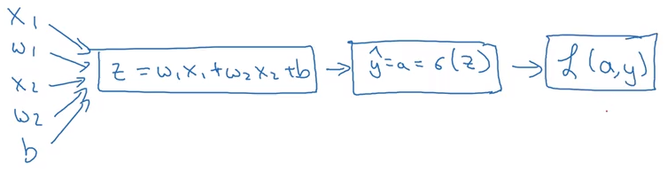
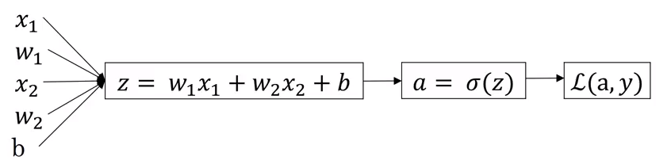

Welcome back. In this video, we'll talk about how to compute derivatives for you to implement gradient descent for logistic regression. 

The key takeaway will be what you need to implement, that is, the key equations you need in order to implement gradient descent for logistic regression. 

In this video, I want to do this computation using the computation graph. 

I have to admit, using the computation graph is a little bit of an overkill for deriving gradient descent for logistic regression, but I want to start explaining things this way to get you familiar with these ideas, so that, hopefully, it will make a bit more sense when we talk about full-fledged neural networks. 

So that, let's dive into gradient descent for logistic regression. 

To recap, we had set up logistic regression as follows, your predictions, $\hat y$, is defined as follows, where $z$ is that.

```{r fig.marginwdth = TRUE, fig.cap = " ", out.width="80%", cache=TRUE, echo=FALSE}

```
If we focus on just one example for now, then the loss, or respect to that one example, is defined as follows, where $a$ is the output of logistic regression, and Y is the ground truth label. 

```{r fig.marginwdth = TRUE, fig.cap = " ", out.width="90%", cache=TRUE, echo=FALSE}

```
Let's write this out as a computation graph and for this example, let's say we have only two features, $x_1$ and $x_2$. In order to compute $z$, we'll need to input $w_1$, $w_2$, and $b$, in addition to the feature values $x_1$, $x_2$. These things, in a computational graph, get used to compute $z$, which is $w_1 x_1 + w_2 x_2 + b$, a rectangular box around that. 

Then, we compute $\hat y$, or $a = \sigma(z)$, that's the next step in the computation graph, and then, finally, we compute $\mathcal {L}(a,y)$. In logistic regression, what we want to do is to modify the parameters, $w$ and $b$, in order to reduce this loss, $\mathcal L$. 

We've described the four propagation steps of how you actually compute the loss on a single training example, now let's talk about how you can go backwards to compute the derivatives. 

Here's a cleaned-up version of the diagram:

```{r fig.marginwdth = TRUE, fig.cap = "", out.width="90%", cache=TRUE, echo=FALSE}

```

Because what we want to do is compute derivatives with respect to this loss, the first thing we want to do, when going backwards is to compute the derivative of this loss with respect to, the script over there, with respect to this variable $a$: $\frac {d\mathcal L}{da}$. 

So, in the code, you just use $da$ to denote this variable. It turns out that if you are familiar with calculus, you could show that this ends up being $-\frac {y}{a} + \frac {1-y}{1-a}$. And the way you do that is you take the formula for the loss and, if you're familiar with calculus, you can compute the derivative with respect to the variable, lowercase $a$, and you get this formula. 

But if you're not familiar with calculus, don't worry about it, we'll provide the derivative formulas you need throughout this course. 

If you are an expert in calculus, I encourage you to look up the formula for the loss from their previous slide and try taking derivative with respect to $a$ using calculus, but if you don't know enough calculus to do that, don't worry about it. 

Now, having computed this quantity of $da$, and the derivative or your final output variable with respect to $a$, you can then go backwards.

It turns out that you can show $dz$, which, this is the Python code variable name, this is going to be the derivative of the loss, versus back to $z$, or for L, you could really write the loss including $a$ and $y$ explicitly as parameters or not, right?
$$dz = \frac {d\mathcal L}{dz} = \frac {\mathcal L(a,y)}{dz}$$
Either type of notation is equally acceptable. We can show that this is equal to $(a-y)$. 

> Just a couple of comments only for those of you experts in calculus, if you're not expert in calculus, don't worry about it. But it turns out that this $\frac {d\mathcal L}{dz}$, this can be expressed as
$\frac {d\mathcal L}{da} \frac {da}{dz}$, and it turns out that $\frac {da}{dz}$, this turns out to be $a \, (1-a)$, and $\frac {d\mathcal L}{da}$ we have previously worked out over here, if you take these two quantities, $\frac {d\mathcal L}{da}$, which is this term^[$-\dfrac {y}{a} + \dfrac {1-y}{1-a}$], together with $\frac {da}{dz}$, which is this term^[$a \, (1-a)$], and just take these two things and multiply them, you can show that the equation simplifies to $(a-y)$. \
That's how you derive it, and that this is really the chain rule that have briefly eluded to before. \
Feel free to go through that calculation yourself if you are knowledgeable in calculus, but if you aren't, all you need to know is that you can compute $dz$ as $(a-y$, and we've already done that calculus for you. 

Then, the final step in that computation is to go back to compute how much you need to change $w$ and $b$. In particular, you can show that the derivative with respect to $w_1$, and in quotes, call this $dw_1$, that this is equal to $x_1 \, dz$^[$\dfrac {d\mathcal L}{dw_1}$]. Then, similarly, $dw_2$, which is how much you want to change $w_2$, is $x_2 \, dz$, and $db$, is equal to $dz$. 

If you want to do gradient descent with respect to just this one example, what you would do is the following; you would use this formula $dz = (a-y)$ to compute $dz$, and then use these formulas:
$$dw_1 = x_1 \, dz  \\
dw_2 = x_2 \, dz    \\
db = dz
$$
to compute $dw_1$, $dw_2$, and $db$, and then you perform these updates. $w_1$ gets updated as $w_1$ minus the learning rate $\alpha$, times $dw_1$; $dw_2$ gets updated similarly; and $b$ gets set as $b$ minus the learning rate $\alpha$ times $db$:
$$ w_1 := w_1 - \alpha \, \mathrm dw_1 \\
   w_2 := w_2 - \alpha \, \mathrm dw_2 \\
   b := b - \alpha \, \mathrm db
$$

And so, this will be one step upgrade with respect to a single example. 

You see in how to compute derivatives and implement gradient descent for logistic regression with respect to a single training example. But training logistic regression model, you have not just one training example given training sets of $m$ training examples. 

In the next video, let's see how you can take these ideas and apply them to learning, not just from one example, but from an entire training set.
