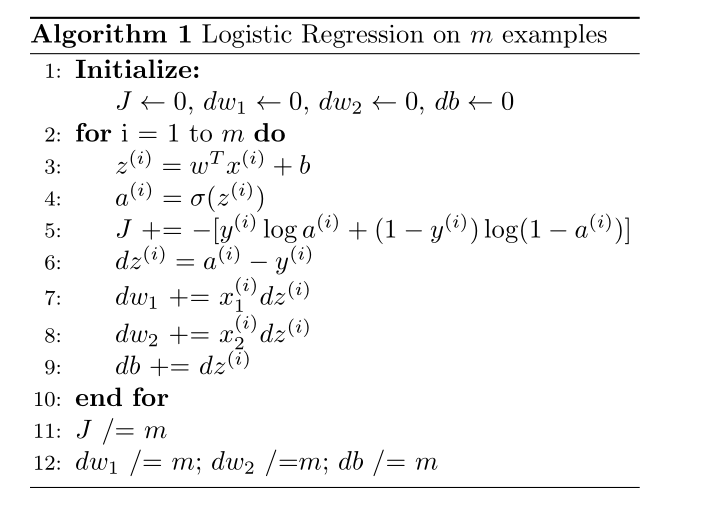

In a previous video you saw how to compute derivatives and implement gradient descent with respect to just one training example for logistic regression. Now we want to do it for $m$ training examples.

To get started, let's remind ourselves that the definition of the cost function $J$.

Cost function $J(w,b)$, which you care about is this: 
$$J(w,b) = \frac {1}{m} \sum_{i=1}^m \mathcal L (a^{(i)}, y^{(i)})$$
the average, by the loss when your algorithm output $a^{(i)}$ on the example $y$, where  $a^{(i)}$ is the prediction $\hat y$ on the $^{(i)}$ training example, which is $\sigma(z^{(i)})$, which is equal to $\sigma(w^T x^{(i)} + b)$.

so what we show in the previous slide is for any single training example how to compute the derivatives when you have just one training example. So,

$$dw_1^{(i)}, d w_2^{(i)}, db^{(i)}$$
with now the superscript $^{(i)}$ to denote the corresponding values you get if you are doing what we did on the previous slide but just using the one training example
$$(x^{(i)}, y^{(i)})$$

So, now you notice the overall cost functions is the average of the individual losses. So it turns out that the derivative respect to, say $w_1$, of the overall cost function, is also going to be the average of derivatives respect to $w_1$ of the individual loss terms
$$\frac {\partial}{\partial w_1} J(w,b) = \frac {1}{m} \sum_{i=1}^m \frac {\partial}{\partial w_1} \mathcal L (a^{(i)}, y^{(i)})$$
but previously, we have already shown how to compute this term:
$$\frac {\partial}{\partial w_1} \mathcal L (a^{(i)}, y^{(i)}) = dw_1^{(i)} - (x^{(i)}, y^{(i)})$$
which we, on the previous slide, showed how to compute this on a single training example. So, what you need to do is really compute these derivatives, as we showed on the previous training example, and average them, and this will give you the overall gradient that you can use to implement gradient descent.


I know there was a lot of details but let's take all of this up and wrap this up into a concrete algorithm, and what you should implement together logistic regression with gradient descent working.

So let's see what you can do.

Let's initialize $J=0, dw_1=0, dw_2=0 , db= 0$, and what we're going to do is use a `for` loop over the training set and compute the derivatives to respect each training example, and then add them up all. So, see as we do it. 

`for` $i$ equals 1 through $m$, so $m$ is the number of training examples, we compute $z^{(i)}$ equals $w$ transpose $x^{(i)}$ plus $b$, and the prediction $a^{(i)}$ is equal to $\sigma(z^{(i)})$. Then let's add up $J$  plus equals $y^{(i)} \log a^{(i)} + (1- y^{(i)}) \log (1 -a^{(i)})$, and then put a negative sign in front of the whole thing. And then as we saw earlier, we have $dz^{(i)}$ is equal to $a^{(i)}$ minus $y^{(i)}$, and $dw_1$ gets plus equals $x_1^{(i)} dz^{(i)}$; $w_2$ plus equals $x_2^{(i)} dz^{(i)}$.
And I'm doing this calculation assuming that you have just two features, so the $n$ is equal to 2, otherwise you do this for $dw_1$, $dw_2$, $dw_3$, and so on; and $db$ plus equals $dz^{(i)}$, and I guess that's the end of the for loop.

```{r fig.marginwidth = TRUE, fig.cap = "", out.width="95%", cache=TRUE, echo=FALSE}

```

And then, finally, having done this for all $m$ training examples, you will still need to divide by $m$ because we're computing averages. So, $dw_1$ divide, equals $m$; $dw_2$ to divide, equals $m$; $db$ divide, equals $m$ in all the complete averages.

And so with all of these calculations you've just computed the derivative of the cost function $J$ with respect to the three parameters $w_1$, $w_2$, and $b$.

Just a comment on details what we're doing. We're using $dw_1$, $dw_2$, and $db$ as `accumulators`, right? So, that after this computation you know $dw_1$ is equal to the derivative of your overall cost function with respect to $w_1$. And similarly for $dw_2$, and $db$. So notice that $dw_1$ and $dw_2$ do not have a superscript $^{(i)}$ because we're using them in this code as accumulators, to sum over the entire training set, whereas, in contrast, $dz^{(i)}$ here, this was on $dz$ with respect to just one single training example. That is why that has a superscript $^{(i)}$ to refer to the one training example either that's computer on.

And so having finished all these calculations to implement one step of gradient descent you implement $w_1$ gets updated as $w_1$ minus a learning rate $\alpha$ times $dw_1$; $w_2$ gives updates $w_2$ minus the learning rate times $dw_2$, and $b$ gives update as $b$ minus learning rate times $db$, where $dw_1$, $dw_2$, and $db$ where you know as computed and finally $J$ here would also be a correct value for your cost function.


## Implement multiple steps of gradient descent
So everything on the slide implements just one single step of gradient descent, so you have to repeat everything on this slide multiple times in order to take multiple steps of gradient descent. In case these details seem too complicated, again, don't worry too much about it for now. Hopefully all this will be clearer when you go and implement this in the programming assignment.

But it turns out there are two weaknesses with the calculation as with as was implemented here, which is that to implement logistic regression this way you need to write two `for` loops. The first `for` loop is a small loop over the $m$ training examples, and the second `for` loop is a `for` loop over all the features over here. 

So in this example we just had two features, so $n$ is 2 equal to 2 and $n^x$ equals 2, but if you have more features you end up writing your $dw_1$, $dw_2$, and you have similar computations for $dw_3$, and so on, down to $dw_n$, so seems like you need to have a $for$ loop over the features over all $n$ features.


## `for` loops are not efficient
When you're implementing deep learning algorithms you find that having explicit `for` loops in your code makes your algorithm run less efficiently, and so in the deep learning era would move to a bigger and bigger data sets and so 
being able to implement your algorithms without using explicit `for` loops is really important and will help you to scale to much bigger data sets.


## Vectorization
So it turns out that there are set of techniques called [vectorization techniques]() that allows you to get rid of these explicit `for` loops in your code. I think in the pre deep learning era, that's before the rise of deep learning, vectorization was a nice to have -you could sometimes do it to speed a code-, and sometimes not, but in the deep learning era vectorization that is getting rid of for loops like this and like this has become really important because we're more and more training on very large datasets and so you really need your code to be very efficient.

So in the next few videos we'll talk about vectorization and how to implement all this without using even a single `for` loop.

So of this I hope you have a sense of how to implement logistic regression or gradient descent for logistic regression. Things will be clearer when you implement the program exercise but before actually doing the program exercise let's first talk about vectorization, so then you can implement this whole thing implement a single iteration of gradient descent without using any `for` loops.
